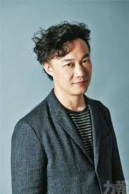

# Welcome

Hi guys, welcome to my website!

## Background

* This is JingYao Geng. You may also call me Nancy if you like. I come from China. 
* Currently, I am a first-year Bio-statistics master student in Columbia University Mailman School of Public Health.
* If you would like to know more about me please click: [More Information](https://jg4294.github.io/about.html)

## My Favoriate Things

I love listening music. It can always calm me down.

**My favorites singer is **Eason Chen**.** 

And recently, I love "[Cloudy Day ](https://www.youtube.com/watch?v=9Z0aHUUv88Y)" the most.

Here is more information about Eason Chen:

* [Eason Chen](https://en.wikipedia.org/wiki/Eason_Chan)

